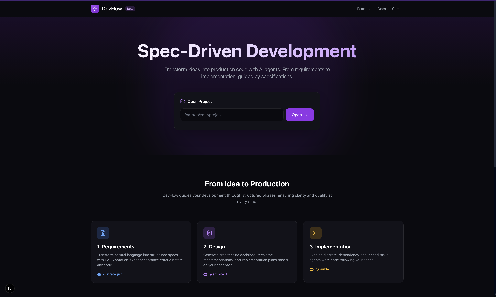
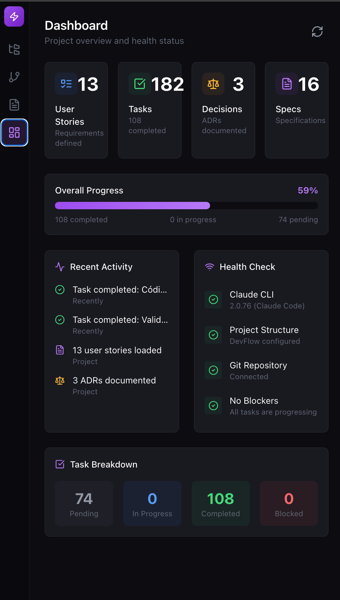
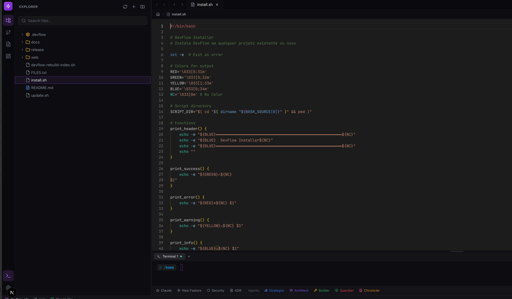
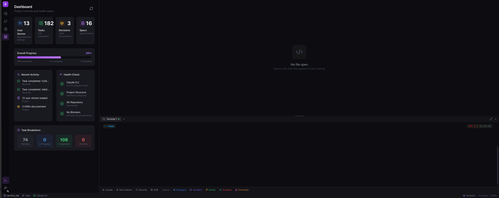
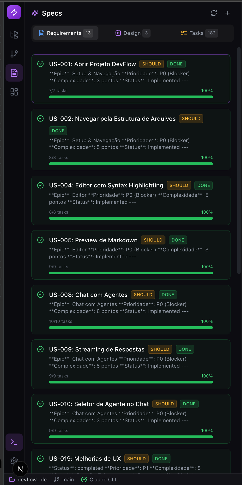

# DevFlow v0.5.0 - Sistema Multi-Agentes + Web IDE

Sistema de multi-agentes especializados para desenvolvimento de software, agora com **Web IDE** integrada para visualização e controle do fluxo de trabalho.

[](docs/CHANGELOG.md)
[](LICENSE)

## Screenshots











---

## 🆕 Novidades v0.5.0 - Terminal como Interface Principal

### Web IDE
Interface visual completa para gerenciar seu projeto DevFlow:

- **Terminal Integrado** - Interface principal via xterm.js + node-pty
- **Dashboard** - Métricas do projeto, health check, status dos agentes
- **Specs Panel** - Visualize requirements, design decisions e tasks
- **File Explorer** - Navegue pelo código com preview de markdown/mermaid
- **Editor Monaco** - Editor profissional com syntax highlighting
- **Settings** - Configure tema, fonte, terminal

### Melhorias v0.5.0
- Terminal substituiu Chat como interface principal
- WebGL addon para renderização nítida em displays retina
- Toast notifications para feedback de operações
- Skeleton loaders para estados de carregamento
- Suporte a Windows via WSL

---

## 🚀 Instalação

### Requisitos

#### CLI (Mínimo)
- Claude Code CLI (`npm i -g @anthropic-ai/claude-code`)
- Git
- Bash

#### Web IDE (Adicional)
- Node.js 18+ (recomendado 20 LTS)
- Python 3 (para node-gyp)
- GCC/G++ e Make (compilação do node-pty)

### Instalação Rápida

```bash
# Clone o repositório
git clone https://github.com/evolve-labs-cloud/devflow.git
cd devflow

# Instale no seu projeto (verifica dependências automaticamente)
./install.sh /caminho/para/seu-projeto

# Opções do instalador:
./install.sh --help        # Ver ajuda
./install.sh --skip-deps   # Pular verificação de dependências
```

O instalador detecta seu sistema operacional e mostra os comandos para instalar dependências faltantes.

### Dependências por Sistema

#### Debian/Ubuntu
```bash
sudo apt-get update
sudo apt-get install -y build-essential python3 git
curl -fsSL https://deb.nodesource.com/setup_20.x | sudo -E bash -
sudo apt-get install -y nodejs
npm install -g @anthropic-ai/claude-code
```

#### Fedora
```bash
sudo dnf groupinstall -y "Development Tools"
sudo dnf install -y python3 git nodejs npm
npm install -g @anthropic-ai/claude-code
```

#### RHEL/CentOS/Rocky
```bash
sudo dnf groupinstall -y "Development Tools"
sudo dnf install -y python3 git
curl -fsSL https://rpm.nodesource.com/setup_20.x | sudo bash -
sudo dnf install -y nodejs
npm install -g @anthropic-ai/claude-code
```

#### macOS
```bash
xcode-select --install
brew install node
npm install -g @anthropic-ai/claude-code
```

#### Windows (WSL)
```powershell
# PowerShell como Admin
wsl --install
```
Depois siga as instruções de Debian/Ubuntu no terminal WSL.

### Web IDE (Opcional)
```bash
cd devflow/web
npm install
npm run dev
# Acesse http://localhost:3000
```

---

## 🤖 Os 5 Agentes

| Agente | Função | Uso |
|--------|--------|-----|
| **/agents:strategist** | Planejamento & Produto | Requisitos, PRDs, user stories |
| **/agents:architect** | Design & Arquitetura | Decisões técnicas, ADRs, APIs |
| **/agents:builder** | Implementação | Código, reviews, refactoring |
| **/agents:guardian** | Qualidade & Segurança | Testes, security, performance |
| **/agents:chronicler** | Documentação & Memória | CHANGELOG, snapshots, stories |

### 🚨 Hard Stops

Cada agente tem limites rígidos:

```
/agents:strategist → APENAS planejamento (NUNCA código)
/agents:architect  → APENAS design técnico (NUNCA implementação)
/agents:builder    → APENAS código (NUNCA requisitos)
/agents:guardian   → APENAS QA/segurança (NUNCA features)
/agents:chronicler → APENAS documentação (NUNCA código)
```

### Fluxo de Trabalho

```
/agents:strategist → /agents:architect → /agents:builder → /agents:guardian → /agents:chronicler
```

---

## 🖥️ Web IDE Features

### Dashboard
- Métricas do projeto (specs, decisões, tasks)
- Health check (Claude CLI, .devflow, git)
- Status em tempo real

### Specs Panel
- **Requirements** - User stories com acceptance criteria
- **Design** - Architecture Decision Records (ADRs)
- **Tasks** - Tarefas de implementação

### Editor
- Monaco Editor (VS Code engine)
- Syntax highlighting para 50+ linguagens
- Preview de Markdown com Mermaid diagrams
- Múltiplas tabs com indicador de dirty state

### Terminal
- Terminal integrado via xterm.js + node-pty
- WebGL rendering para displays de alta resolução
- Histórico de comandos
- Resize responsivo

---

## 📁 Estrutura do Projeto

```
devflow/
├── .claude/            # Comandos e agentes
│   └── commands/       # Skills dos 5 agentes
│       └── agents/     # Definições dos agentes
│
├── .devflow/           # Configuração do projeto
│   ├── snapshots/      # Histórico do projeto
│   └── project.yaml    # Estado do projeto
│
├── docs/               # Documentação
│   ├── decisions/      # ADRs
│   ├── planning/       # Stories e specs
│   └── images/         # Screenshots
│
└── web/                # Web IDE
    ├── app/            # Next.js pages
    ├── components/     # React components
    └── lib/            # Utilities
```

---

## 📊 Versões

| Versão | Features |
|--------|----------|
| v0.1.0 | Multi-agent system, Documentation automation |
| v0.2.0 | Structured metadata, Knowledge graph |
| v0.3.0 | Hard stops, Mandatory delegation |
| v0.4.0 | Web IDE completa |
| **v0.5.0** | **Terminal como interface principal, WSL support** |

---

## 📚 Documentação

- **[Quick Start](docs/QUICKSTART.md)** - Comece em 5 minutos
- **[Instalação](docs/INSTALLATION.md)** - Guia detalhado
- **[Arquitetura](docs/ARCHITECTURE.md)** - Como funciona
- **[Changelog](docs/CHANGELOG.md)** - Histórico de mudanças

---

## 🛠️ Tech Stack (Web IDE)

- **Next.js 15** - Framework React
- **TypeScript** - Type safety
- **Tailwind CSS** - Styling
- **Monaco Editor** - Code editing
- **xterm.js** - Terminal emulator
- **node-pty** - PTY para terminal real
- **Zustand** - State management
- **Lucide Icons** - Iconografia

---

## 📜 Licença

MIT License - veja [LICENSE](LICENSE) para detalhes.

---

**DevFlow v0.5.0** - Desenvolvido por [Evolve Labs](https://evolvelabs.cloud)
