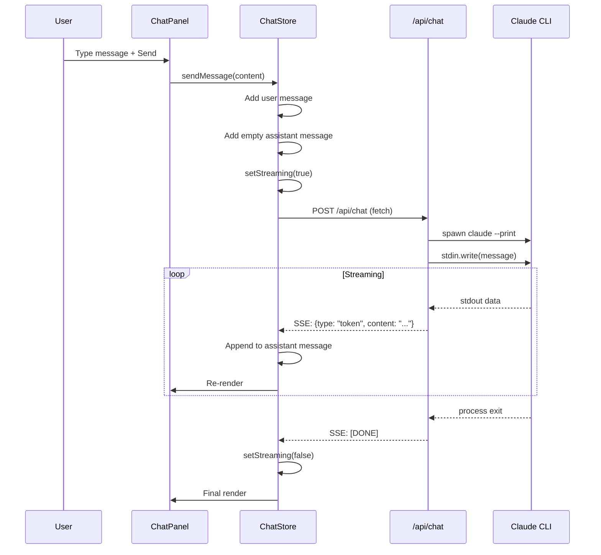
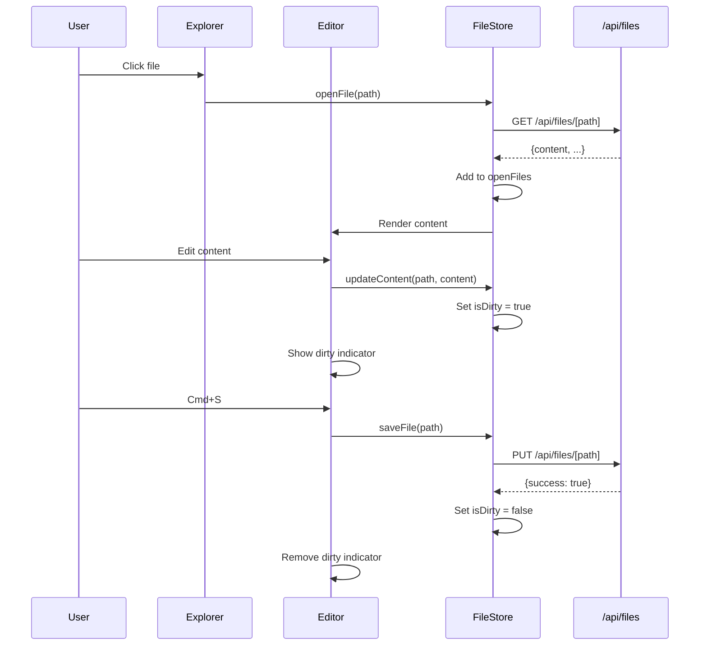

# Design de Arquitetura: DevFlow IDE Web

**Versão**: 1.0
**Data**: 2025-12-19
**Autor**: @architect
**Status**: Approved

---

## 1. Visão Geral

### 1.1 Diagrama de Contexto (C4 Level 1)

```
┌─────────────────────────────────────────────────────────────────┐
│                         Developer                                │
│                      (Primary User)                              │
└───────────────────────────┬─────────────────────────────────────┘
                            │
                            │ HTTP (localhost:3000)
                            ▼
┌─────────────────────────────────────────────────────────────────┐
│                                                                  │
│                     DevFlow IDE Web                              │
│                       (Next.js)                                  │
│                                                                  │
└────────────────┬────────────────────────────────┬───────────────┘
                 │                                │
    subprocess   │                                │ fs operations
    + streaming  │                                │
                 ▼                                ▼
┌─────────────────────────┐      ┌─────────────────────────────────┐
│                         │      │                                  │
│    Claude Code CLI      │      │    Local Filesystem              │
│    (AI Agent Engine)    │      │    (.devflow/, docs/)            │
│                         │      │                                  │
└─────────────────────────┘      └─────────────────────────────────┘
```

### 1.2 Diagrama de Container (C4 Level 2)

```
┌─────────────────────────────────────────────────────────────────────────┐
│                           DevFlow IDE Web                                │
├─────────────────────────────────────────────────────────────────────────┤
│                                                                          │
│  ┌─────────────────────────────────────────────────────────────────┐   │
│  │                        Frontend (React)                          │   │
│  ├──────────┬──────────┬──────────┬──────────┬──────────┬─────────┤   │
│  │  Layout  │  Editor  │   Chat   │  Graph   │ Dashboard│ Terminal│   │
│  │  Shell   │  Panel   │  Panel   │  Panel   │  Panel   │  Panel  │   │
│  ├──────────┴──────────┴──────────┴──────────┴──────────┴─────────┤   │
│  │                                                                  │   │
│  │                    Zustand State Management                      │   │
│  │    ┌────────────┬────────────┬────────────┬────────────┐        │   │
│  │    │ FileStore  │ ChatStore  │ProjectStore│ UIStore    │        │   │
│  │    └────────────┴────────────┴────────────┴────────────┘        │   │
│  └─────────────────────────────────┬────────────────────────────────┘   │
│                                    │                                     │
│                                    │ fetch/SSE                           │
│                                    ▼                                     │
│  ┌─────────────────────────────────────────────────────────────────┐   │
│  │                    API Routes (Next.js)                          │   │
│  ├─────────────┬─────────────┬─────────────┬─────────────┐         │   │
│  │  /api/chat  │ /api/files  │/api/project │ /api/health │         │   │
│  │   (SSE)     │   (CRUD)    │  (config)   │  (status)   │         │   │
│  └──────┬──────┴──────┬──────┴──────┬──────┴─────────────┘         │   │
│         │             │             │                                │   │
└─────────┼─────────────┼─────────────┼────────────────────────────────┘   │
          │             │             │
          │ spawn       │ fs          │ fs
          ▼             ▼             ▼
    ┌───────────┐  ┌─────────┐  ┌─────────────┐
    │Claude CLI │  │  Files  │  │   Project   │
    └───────────┘  └─────────┘  │   Config    │
                                └─────────────┘
```

---

## 2. Estrutura de Pastas

```
devflow-ide/
├── app/                          # Next.js App Router
│   ├── layout.tsx                # Root layout (providers, global styles)
│   ├── page.tsx                  # Landing/project selector
│   ├── globals.css               # Global styles
│   │
│   ├── ide/                      # IDE workspace
│   │   ├── layout.tsx            # IDE layout (panels)
│   │   ├── page.tsx              # Main IDE view
│   │   └── loading.tsx           # Loading state
│   │
│   └── api/                      # API Routes
│       ├── chat/
│       │   └── route.ts          # POST: Chat with Claude (SSE)
│       ├── files/
│       │   ├── route.ts          # GET: List, POST: Create
│       │   ├── [path]/
│       │   │   └── route.ts      # GET: Read, PUT: Update, DELETE
│       │   └── tree/
│       │       └── route.ts      # GET: File tree
│       ├── project/
│       │   ├── route.ts          # GET: Project info
│       │   ├── open/
│       │   │   └── route.ts      # POST: Open project
│       │   └── recent/
│       │       └── route.ts      # GET: Recent projects
│       └── health/
│           └── route.ts          # GET: System health
│
├── components/
│   ├── ui/                       # shadcn/ui components
│   │   ├── button.tsx
│   │   ├── card.tsx
│   │   ├── dialog.tsx
│   │   ├── dropdown-menu.tsx
│   │   ├── input.tsx
│   │   ├── tabs.tsx
│   │   ├── tooltip.tsx
│   │   └── ...
│   │
│   ├── layout/                   # Layout components
│   │   ├── Shell.tsx             # Main IDE shell
│   │   ├── Sidebar.tsx           # Left sidebar
│   │   ├── Panel.tsx             # Resizable panel
│   │   ├── StatusBar.tsx         # Bottom status bar
│   │   └── Header.tsx            # Top header
│   │
│   ├── explorer/                 # File Explorer
│   │   ├── FileExplorer.tsx      # Main component
│   │   ├── FileTree.tsx          # Tree view
│   │   ├── FileNode.tsx          # Single node
│   │   ├── FileIcon.tsx          # Icon by type
│   │   └── FileContextMenu.tsx   # Right-click menu
│   │
│   ├── editor/                   # Code Editor
│   │   ├── Editor.tsx            # Main wrapper
│   │   ├── MonacoEditor.tsx      # Monaco integration
│   │   ├── EditorTabs.tsx        # Tab management
│   │   ├── EditorTab.tsx         # Single tab
│   │   └── MarkdownPreview.tsx   # MD preview panel
│   │
│   ├── chat/                     # Chat Panel
│   │   ├── ChatPanel.tsx         # Main container
│   │   ├── ChatMessages.tsx      # Message list
│   │   ├── ChatMessage.tsx       # Single message
│   │   ├── ChatInput.tsx         # Input + send
│   │   ├── AgentSelector.tsx     # Agent dropdown
│   │   └── StreamingIndicator.tsx# Loading state
│   │
│   ├── graph/                    # Knowledge Graph
│   │   ├── GraphPanel.tsx        # Main container
│   │   ├── GraphCanvas.tsx       # React Flow canvas
│   │   ├── GraphNode.tsx         # Custom node
│   │   ├── GraphEdge.tsx         # Custom edge
│   │   ├── GraphControls.tsx     # Zoom/pan controls
│   │   └── GraphFilters.tsx      # Type filters
│   │
│   ├── dashboard/                # Dashboard
│   │   ├── DashboardPanel.tsx    # Main container
│   │   ├── StatsCard.tsx         # Stat card
│   │   ├── StoriesList.tsx       # Stories by status
│   │   ├── ActivityTimeline.tsx  # Recent activity
│   │   └── HealthStatus.tsx      # Project health
│   │
│   ├── terminal/                 # Terminal
│   │   ├── TerminalPanel.tsx     # Main container
│   │   └── XTerminal.tsx         # xterm.js wrapper
│   │
│   └── common/                   # Shared components
│       ├── LoadingSpinner.tsx
│       ├── ErrorBoundary.tsx
│       ├── EmptyState.tsx
│       └── Markdown.tsx          # MD renderer
│
├── lib/
│   ├── stores/                   # Zustand stores
│   │   ├── index.ts              # Export all
│   │   ├── fileStore.ts          # File state
│   │   ├── chatStore.ts          # Chat state
│   │   ├── projectStore.ts       # Project state
│   │   └── uiStore.ts            # UI state (panels, theme)
│   │
│   ├── hooks/                    # Custom hooks
│   │   ├── useChat.ts            # Chat with streaming
│   │   ├── useFiles.ts           # File operations
│   │   ├── useProject.ts         # Project management
│   │   ├── useKeyboardShortcuts.ts
│   │   └── useLocalStorage.ts
│   │
│   ├── services/                 # API clients
│   │   ├── chatService.ts        # /api/chat
│   │   ├── fileService.ts        # /api/files
│   │   ├── projectService.ts     # /api/project
│   │   └── healthService.ts      # /api/health
│   │
│   ├── claude/                   # Claude CLI integration
│   │   ├── cli.ts                # Spawn and manage CLI
│   │   ├── parser.ts             # Parse CLI output
│   │   └── types.ts              # CLI types
│   │
│   ├── utils/
│   │   ├── cn.ts                 # classnames utility
│   │   ├── path.ts               # Path utilities
│   │   ├── markdown.ts           # MD utilities
│   │   └── debounce.ts
│   │
│   └── types/
│       ├── index.ts
│       ├── file.ts               # File types
│       ├── chat.ts               # Chat types
│       ├── project.ts            # Project types
│       └── agent.ts              # Agent types
│
├── public/
│   ├── icons/                    # File type icons
│   └── logo.svg
│
├── config/
│   ├── agents.ts                 # Agent definitions
│   ├── shortcuts.ts              # Keyboard shortcuts
│   └── templates.ts              # File templates
│
├── next.config.js
├── tailwind.config.ts
├── tsconfig.json
├── package.json
└── README.md
```

---

## 3. API Contracts

### 3.1 Chat API

```typescript
// POST /api/chat
// Content-Type: application/json
// Response: text/event-stream (SSE)

// Request
interface ChatRequest {
  message: string;
  projectPath: string;
  agent?: string;         // "@strategist", "@builder", etc
  sessionId?: string;     // For conversation continuity
}

// SSE Events
interface ChatEvent {
  type: 'token' | 'done' | 'error' | 'tool_use' | 'tool_result';
  content?: string;
  tool?: {
    name: string;
    input: Record<string, unknown>;
  };
  result?: 'success' | 'error';
  error?: string;
}

// SSE Format
// data: {"type":"token","content":"Hello"}
// data: {"type":"token","content":" World"}
// data: {"type":"done","result":"success"}
// data: [DONE]
```

### 3.2 Files API

```typescript
// GET /api/files/tree?path=/project/path
interface FileTreeResponse {
  root: FileNode;
}

interface FileNode {
  name: string;
  path: string;
  type: 'file' | 'directory';
  extension?: string;
  children?: FileNode[];
  size?: number;
  modifiedAt?: string;
}

// GET /api/files/[path]
interface FileReadResponse {
  path: string;
  content: string;
  encoding: 'utf-8' | 'base64';
  size: number;
  modifiedAt: string;
}

// PUT /api/files/[path]
interface FileWriteRequest {
  content: string;
}

interface FileWriteResponse {
  success: boolean;
  path: string;
  modifiedAt: string;
}

// POST /api/files
interface FileCreateRequest {
  path: string;
  type: 'file' | 'directory';
  content?: string;
  template?: string;      // "story", "spec", "adr"
}

// DELETE /api/files/[path]
interface FileDeleteResponse {
  success: boolean;
  path: string;
}
```

### 3.3 Project API

```typescript
// POST /api/project/open
interface ProjectOpenRequest {
  path: string;
}

interface ProjectOpenResponse {
  success: boolean;
  project: ProjectInfo;
  error?: string;
}

interface ProjectInfo {
  path: string;
  name: string;
  isValid: boolean;
  hasDevflow: boolean;
  hasClaudeProject: boolean;
  stats: {
    specs: number;
    stories: number;
    adrs: number;
    agents: number;
  };
  knowledgeGraph?: KnowledgeGraph;
}

// GET /api/project/recent
interface RecentProjectsResponse {
  projects: {
    path: string;
    name: string;
    lastOpened: string;
  }[];
}
```

### 3.4 Health API

```typescript
// GET /api/health?projectPath=/path
interface HealthResponse {
  claudeCli: {
    installed: boolean;
    authenticated: boolean;
    version?: string;
    error?: string;
  };
  project: {
    valid: boolean;
    hasDevflow: boolean;
    hasClaudeProject: boolean;
  };
  system: {
    platform: string;
    nodeVersion: string;
  };
}
```

---

## 4. State Management (Zustand)

### 4.1 File Store

```typescript
// lib/stores/fileStore.ts
interface FileState {
  // State
  tree: FileNode | null;
  openFiles: OpenFile[];
  activeFile: string | null;
  expandedFolders: Set<string>;

  // Actions
  loadTree: (projectPath: string) => Promise<void>;
  openFile: (path: string) => Promise<void>;
  closeFile: (path: string) => void;
  setActiveFile: (path: string) => void;
  saveFile: (path: string, content: string) => Promise<void>;
  createFile: (path: string, type: 'file' | 'directory', template?: string) => Promise<void>;
  deleteFile: (path: string) => Promise<void>;
  renameFile: (oldPath: string, newPath: string) => Promise<void>;
  toggleFolder: (path: string) => void;
}

interface OpenFile {
  path: string;
  content: string;
  originalContent: string;
  isDirty: boolean;
  language: string;
}
```

### 4.2 Chat Store

```typescript
// lib/stores/chatStore.ts
interface ChatState {
  // State
  messages: ChatMessage[];
  isStreaming: boolean;
  currentAgent: Agent;
  sessions: ChatSession[];
  currentSessionId: string | null;

  // Actions
  sendMessage: (content: string) => Promise<void>;
  cancelStream: () => void;
  setAgent: (agent: Agent) => void;
  clearMessages: () => void;
  loadSession: (sessionId: string) => void;
  createSession: () => void;
}

interface ChatMessage {
  id: string;
  role: 'user' | 'assistant';
  content: string;
  agent?: string;
  timestamp: Date;
  isStreaming?: boolean;
}

interface Agent {
  id: string;
  name: string;
  icon: string;
  color: string;
  description: string;
}

interface ChatSession {
  id: string;
  name: string;
  createdAt: Date;
  messageCount: number;
}
```

### 4.3 Project Store

```typescript
// lib/stores/projectStore.ts
interface ProjectState {
  // State
  currentProject: ProjectInfo | null;
  recentProjects: RecentProject[];
  health: HealthStatus | null;
  isLoading: boolean;

  // Actions
  openProject: (path: string) => Promise<void>;
  closeProject: () => void;
  refreshHealth: () => Promise<void>;
  loadRecentProjects: () => void;
}

interface RecentProject {
  path: string;
  name: string;
  lastOpened: Date;
}
```

### 4.4 UI Store

```typescript
// lib/stores/uiStore.ts
interface UIState {
  // State
  theme: 'light' | 'dark' | 'system';
  sidebarVisible: boolean;
  sidebarWidth: number;
  chatPanelVisible: boolean;
  chatPanelWidth: number;
  activePanel: 'explorer' | 'graph' | 'dashboard';
  terminalVisible: boolean;
  terminalHeight: number;

  // Actions
  setTheme: (theme: 'light' | 'dark' | 'system') => void;
  toggleSidebar: () => void;
  setSidebarWidth: (width: number) => void;
  toggleChatPanel: () => void;
  setChatPanelWidth: (width: number) => void;
  setActivePanel: (panel: string) => void;
  toggleTerminal: () => void;
  setTerminalHeight: (height: number) => void;
}
```

---

## 5. Fluxos de Dados

### 5.1 Chat Flow (Streaming)



### 5.2 File Edit Flow



---

## 6. Component Hierarchy

```
App (layout.tsx)
├── ThemeProvider
├── ProjectProvider
│
└── IDE (ide/layout.tsx)
    ├── Header
    │   ├── Logo
    │   ├── ProjectName
    │   └── Actions (settings, help)
    │
    ├── Shell (resizable panels)
    │   ├── Sidebar (left)
    │   │   ├── TabSelector (explorer/graph/dashboard)
    │   │   └── ActivePanel
    │   │       ├── FileExplorer
    │   │       │   └── FileTree
    │   │       │       └── FileNode (recursive)
    │   │       ├── GraphPanel
    │   │       │   └── GraphCanvas
    │   │       └── DashboardPanel
    │   │           ├── StatsCards
    │   │           └── StoriesList
    │   │
    │   ├── Main (center)
    │   │   ├── EditorTabs
    │   │   │   └── EditorTab
    │   │   └── Editor
    │   │       ├── MonacoEditor
    │   │       └── MarkdownPreview (split)
    │   │
    │   └── ChatPanel (right)
    │       ├── AgentSelector
    │       ├── ChatMessages
    │       │   └── ChatMessage
    │       └── ChatInput
    │
    ├── Terminal (bottom, collapsible)
    │   └── XTerminal
    │
    └── StatusBar
        ├── ProjectStatus
        ├── ClaudeStatus
        └── FileInfo
```

---

## 7. Keyboard Shortcuts

```typescript
// config/shortcuts.ts
export const SHORTCUTS = {
  // Files
  'mod+s': 'file.save',
  'mod+shift+s': 'file.saveAll',
  'mod+w': 'file.close',
  'mod+p': 'file.quickOpen',
  'mod+shift+f': 'file.search',

  // Editor
  'mod+z': 'edit.undo',
  'mod+shift+z': 'edit.redo',
  'mod+f': 'edit.find',
  'mod+h': 'edit.replace',
  'mod+shift+v': 'edit.togglePreview',

  // Panels
  'mod+b': 'view.toggleSidebar',
  'mod+j': 'view.toggleTerminal',
  'mod+shift+e': 'view.focusExplorer',
  'mod+shift+g': 'view.focusGraph',
  'mod+shift+d': 'view.focusDashboard',

  // Chat
  'mod+k': 'chat.focus',
  'mod+l': 'chat.clear',
  'escape': 'chat.cancel',

  // Navigation
  'mod+1': 'tab.first',
  'mod+9': 'tab.last',
  'mod+tab': 'tab.next',
  'mod+shift+tab': 'tab.previous',
};
```

---

## 8. Performance Considerations

### 8.1 Lazy Loading

```typescript
// Monaco Editor - load only when needed
const MonacoEditor = dynamic(
  () => import('@monaco-editor/react'),
  {
    ssr: false,
    loading: () => <EditorSkeleton />
  }
);

// React Flow - load only when graph panel active
const GraphCanvas = dynamic(
  () => import('./GraphCanvas'),
  { loading: () => <GraphSkeleton /> }
);

// Terminal - load only when visible
const XTerminal = dynamic(
  () => import('./XTerminal'),
  { ssr: false }
);
```

### 8.2 Memoization

```typescript
// Memoize expensive computations
const fileTree = useMemo(
  () => buildFileTree(files),
  [files]
);

// Memoize callbacks
const handleSave = useCallback(
  () => saveFile(activeFile),
  [activeFile, saveFile]
);

// Memoize components
const ChatMessage = memo(function ChatMessage({ message }) {
  return <div>{message.content}</div>;
});
```

### 8.3 Virtualization

```typescript
// File tree virtualization for large directories
import { useVirtualizer } from '@tanstack/react-virtual';

// Chat messages virtualization for long conversations
const virtualizer = useVirtualizer({
  count: messages.length,
  getScrollElement: () => scrollRef.current,
  estimateSize: () => 100,
});
```

---

## 9. Security Measures

### 9.1 Path Validation

```typescript
// lib/utils/path.ts
export function isValidProjectPath(path: string): boolean {
  // Must be absolute
  if (!path.startsWith('/')) return false;

  // No path traversal
  if (path.includes('..')) return false;

  // Block sensitive paths
  const blocked = ['/etc', '/usr', '/var', '/root', '/System'];
  if (blocked.some(p => path.startsWith(p))) return false;

  return true;
}

export function sanitizePath(basePath: string, relativePath: string): string {
  const resolved = path.resolve(basePath, relativePath);

  // Ensure resolved path is within base
  if (!resolved.startsWith(basePath)) {
    throw new Error('Path traversal detected');
  }

  return resolved;
}
```

### 9.2 Input Sanitization

```typescript
// Sanitize CLI input
export function sanitizeCliInput(input: string): string {
  // Remove shell special characters
  return input
    .replace(/[;&|`$(){}[\]<>]/g, '')
    .trim();
}

// For display in markdown
export function sanitizeMarkdown(content: string): string {
  return DOMPurify.sanitize(content);
}
```

---

## 10. Next Steps for @builder

### Phase 1: Foundation (Stories US-001, US-002)
1. Setup Next.js project with dependencies
2. Create basic layout (Shell, Sidebar, Header)
3. Implement FileExplorer with tree view
4. Create API route /api/files/tree
5. Implement file open/read

### Phase 2: Editor (Stories US-004, US-005)
1. Integrate Monaco Editor with lazy loading
2. Implement EditorTabs
3. Create MarkdownPreview component
4. Implement file save (Cmd+S)
5. Create API route /api/files/[path]

### Phase 3: Chat (Stories US-008, US-009, US-010)
1. Implement /api/chat with SSE
2. Create ChatPanel with streaming
3. Implement AgentSelector
4. Create useChat hook
5. Test streaming performance

### Phase 4: Polish
1. Add keyboard shortcuts
2. Implement theme toggle
3. Add loading states
4. Error boundaries
5. Basic tests

---

**Document created by @architect**
**Ready for implementation by @builder**
