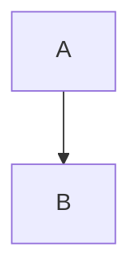

# US-005: Preview de Markdown

**Epic**: Editor
**Prioridade**: P0 (Blocker)
**Complexidade**: 3 pontos
**Status**: Implemented

---

## User Story

**Como** desenvolvedor
**Quero** ver preview do Markdown lado a lado com o editor
**Para** visualizar como o documento ficará formatado

---

## Acceptance Criteria

### AC1: Toggle Preview
```gherkin
Given que tenho arquivo .md aberto no editor
When clico no botão "Preview" ou pressiono Cmd+Shift+V
Then o painel divide em dois: editor | preview
When clico novamente
Then volta ao modo editor apenas
```

### AC2: Preview em Tempo Real
```gherkin
Given que estou com preview aberto
When digito no editor
Then o preview atualiza automaticamente
And o delay máximo é 300ms (debounce)
```

### AC3: Renderização Correta
```gherkin
Given que vejo o preview
Then os elementos são renderizados:
  | Markdown          | Renderização        |
  | # Header          | <h1> grande, bold   |
  | ## Header         | <h2>                |
  | **bold**          | <strong>            |
  | *italic*          | <em>                |
  | `code`            | <code> com bg       |
  | ```code block     | <pre> com syntax    |
  | - item            | <ul><li>            |
  | 1. item           | <ol><li>            |
  | [link](url)       | <a> clicável        |
  |        |                |
  | > quote           | <blockquote>        |
  | ---               | <hr>                |
  | | table |         | <table>             |
```

### AC4: Scroll Sincronizado
```gherkin
Given que tenho editor e preview lado a lado
When faço scroll no editor
Then o preview faz scroll proporcional
And vice-versa (scroll no preview move editor)
```

### AC5: Syntax Highlighting em Code Blocks
```gherkin
Given que tenho code block com linguagem especificada
```typescript
const x = 1;
```
Then o código no preview tem syntax highlighting
And a linguagem é detectada pelo marcador após ```
```

### AC6: Suporte a Mermaid
```gherkin
Given que tenho bloco mermaid no markdown

Then o preview renderiza o diagrama visualmente
And não mostra o código fonte
```

### AC7: Links Internos
```gherkin
Given que tenho link para outro arquivo do projeto
When clico no link no preview
Then o arquivo referenciado abre no editor
```

---

## Technical Notes

```typescript
interface PreviewProps {
  content: string;
  isVisible: boolean;
  onLinkClick: (path: string) => void;
}

// Componentes de renderização
// - react-markdown para parsing
// - remark-gfm para GitHub Flavored Markdown
// - rehype-highlight para syntax highlighting
// - mermaid para diagramas
```

**Configuração react-markdown**:
```typescript
import ReactMarkdown from 'react-markdown';
import remarkGfm from 'remark-gfm';
import rehypeHighlight from 'rehype-highlight';
import mermaid from 'mermaid';

<ReactMarkdown
  remarkPlugins={[remarkGfm]}
  rehypePlugins={[rehypeHighlight]}
  components={{
    code: CodeBlock, // custom para mermaid
    a: InternalLink, // custom para links internos
  }}
>
  {content}
</ReactMarkdown>
```

**Performance**:
- Debounce de 300ms no update
- Virtualização para documentos muito longos
- Lazy render de imagens

---

## UI/UX Notes

```
┌─────────────────────────────────────────────────────────────┐
│ [US-001.md] [📝 Editor] [👁 Preview] [📝👁 Split]           │
├────────────────────────────┬────────────────────────────────┤
│  1 │ # US-001: Abrir       │  US-001: Abrir Projeto        │
│  2 │                       │                                │
│  3 │ **Epic**: Setup       │  Epic: Setup & Navegação      │
│  4 │                       │                                │
│  5 │ ## User Story         │  User Story                    │
│  6 │                       │  ───────────────               │
│  7 │ **Como** dev          │  Como desenvolvedor            │
│  8 │ **Quero** abrir       │  Quero abrir um projeto       │
│  9 │                       │                                │
│ 10 │ ```gherkin            │  ┌─────────────────────┐       │
│ 11 │ Given que...          │  │ Given que estou... │       │
│ 12 │ ```                   │  └─────────────────────┘       │
│    │         EDITOR        │         PREVIEW                │
└────────────────────────────┴────────────────────────────────┘
```

**Modos de visualização**:
- Editor only (default)
- Preview only
- Split (50/50)
- Split com resize drag

**Shortcuts**:
- `Cmd+Shift+V` - Toggle preview
- `Cmd+K V` - Preview to side (VS Code style)

---

## Definition of Done

- [x] Toggle preview funciona
- [x] Preview atualiza em tempo real (< 300ms)
- [x] Todos elementos MD renderizam corretamente
- [x] Syntax highlighting em code blocks
- [x] Mermaid diagrams funcionam
- [x] Scroll sincronizado
- [x] Links internos navegam
- [x] Testes de renderização
- [x] Code review aprovado

---

## Dependencies

- US-004 (editor precisa existir)

---

*Story criada por @strategist*
